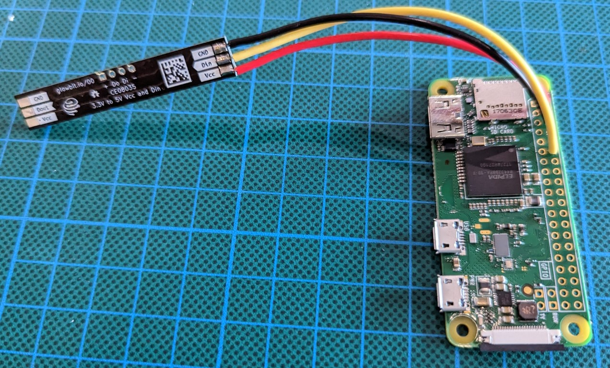
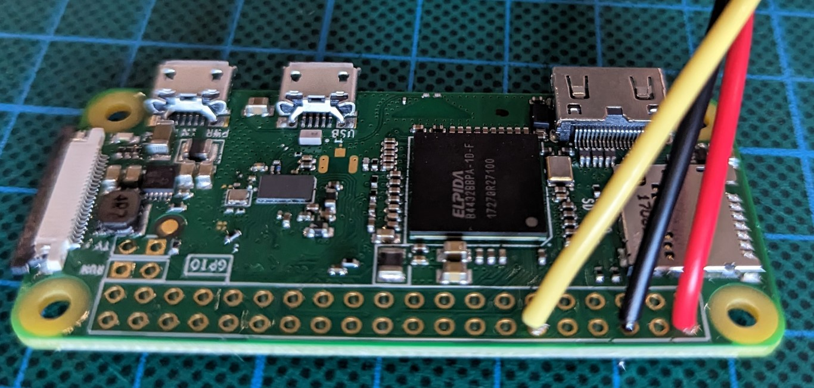
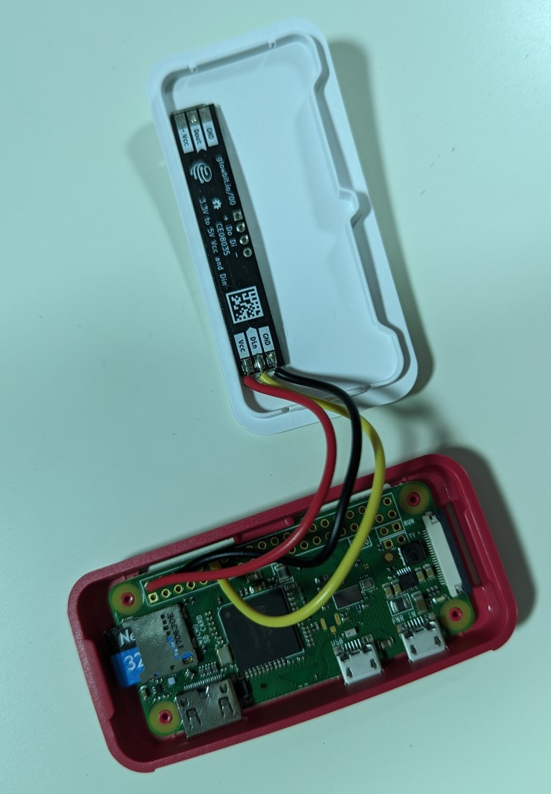

# Hardware setup
A useful way to use midi-arpeggiator is running on a Raspberry Pi with a small strip of LEDs.
The following instructions describe how I set it up, which worked successfully for me but otherwise comes with no guarentees or support.

## Parts required
- [Raspberry Pi 0w](https://core-electronics.com.au/raspberry-pi-zero-w-wireless.html) (wireless is not nessesary, but helps with setup & configuration)
- [Case](https://core-electronics.com.au/raspberry-pi-zero-w-case-enclosure-official.html)
- [Glowbit Stick 1x8](https://core-electronics.com.au/glowbit-stick-1x8.html)
- 3 wires (each ~10cm long) to connect Glowbit Stick to RPi
- 16GB+ microSD card
- PSU for Raspberry Pi (5V 0.5A) or USB micro cable if powering via a Keyboard/Laptop/otherwise
- [USB OTG hub](https://www.ebay.com.au/itm/394327435358)
- USB cables to connect to MIDI keyboards as required
- Superglue

## SD card setup
1. On another computer with a microSD card reader, install [Raspberry Pi Imager](https://www.raspberrypi.com/software/)
2. Insert microSD card into reader and run Raspberry Pi Imager
3. Follow instructions to flash microSD card with the following details:
- Raspberry Pi OS (32 bit) Lite (No Desktop)
- Enable SSH
- Set hostname, username (pi) and password
- Set WiFi & timezone details
- Add WiFi configuration of your home network (so you can configure it remotely)

## Assembly instructions
1. Solder wires:
- Red wire 5V on RPi (pin 2) to Vcc on Glowbit
- Black wire GND on RPi (pin 6) to Gnd on Glowbit
- Yellow wire GPIO18 on RPi (pin 12) to Din on Glowbit



2. Insert SD card into RPi
3. Put RPi board into base of case
4. Use a small amount of superglue to stick the Glowbit in place on the top piece of the case

5. Carefully position excess wire length and clip top & base of case together

6. Use USB OTG hub to connect MIDI devices
7. Plug in PSU and turn Raspberry Pi on

## Software configuration
1. Once the Raspberry Pi has turned on and booted up, it should connect to the WiFi network you configured above, confirm this using `ping HOSTNAME`
2. Use Putty or SSH in terminal to SSH into the raspberry pi using the username and password you configured above
3. Install rust `curl --proto '=https' --tlsv1.3 https://sh.rustup.rs -sSf | sh`
4. Configure other WiFi networks if required `sudo nano /etc/wpa_supplicant/wpa_supplicant.conf`
5. Disconnect & reconnect to SSH
6. Install git `sudo apt update && sudo apt upgrade && sudo apt install git`
7. In order to get `clang-sys` rust library to build on RPi, run the following:
- `sudo apt-get install llvm clang`
- `sudo ln -s /usr/lib/arm-linux-gnueabihf/libclang-11.so.1 /usr/lib/libclang.so`
8. Download code `git clone https://github.com/davidlang42/midi-arpeggiator.git`
9. Build code `cd midi-arpeggiator && cargo build --release`
10. Make a startup script:
- `nano ~/run_on_startup`
- Type this into nano:
```
#!/usr/bin/bash
sleep 10 # to wait for midi devices to be ready
/home/pi/midi-arpeggiator/target/release/midi-arpeggiator /home/pi/arpeggiator_settings.json
```
- Ctrl+X to exit nano (and save)
- `chmod a+x ~/run_on_startup`
11. Make the startup script run on startup:
- `sudo nano /etc/rc.local`
- Append this before the last line: `/home/pi/run_on_startup &`
- Ctrl+X to exit nano (and save)
12. Make a file containing some arpeggiator settings (see [README](/README.md))
- `nano ~/arpeggiator_settings.json`
- Type your settings into nano:
```
{ "finish_pattern": true, "mode": "PressHold", "pattern": "Up", "fixed_steps": 4, "fixed_velocity": 100 },
{ "finish_pattern": true, "mode": "PressHold", "pattern": "Down", "fixed_steps": 3, "fixed_velocity": 100 },
{ "finish_pattern": true, "mode": "PressHold", "pattern": "Up", "fixed_steps": 1, "fixed_velocity": 100 },
{ "finish_pattern": true, "mode": "SyncedPedalRecorder", "pattern": "Up", "fixed_velocity": 100 }
```
- Ctrl+X to exit nano (and save)
13. Reboot to make the arpeggiator run (with MIDI devices attached, see [README](/README.md)) `sudo reboot`
14. Enjoy your Raspberry Pi MIDI arpeggiator!
- If you have any suggested improvements, raise an [issue](https://github.com/davidlang42/midi-arpeggiator/issues) or submit a [pull request](https://github.com/davidlang42/midi-arpeggiator/pulls)
- If you find this useful, consider [buying me a coffee](https://ko-fi.com/davidlang42)
